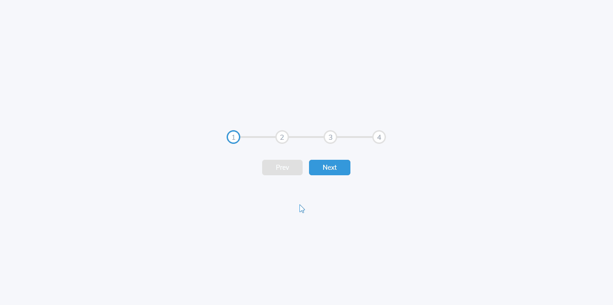
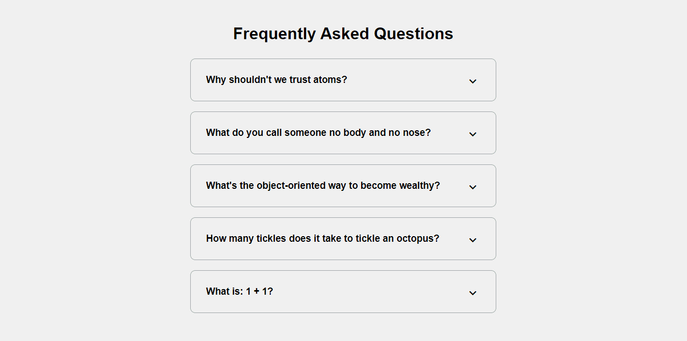
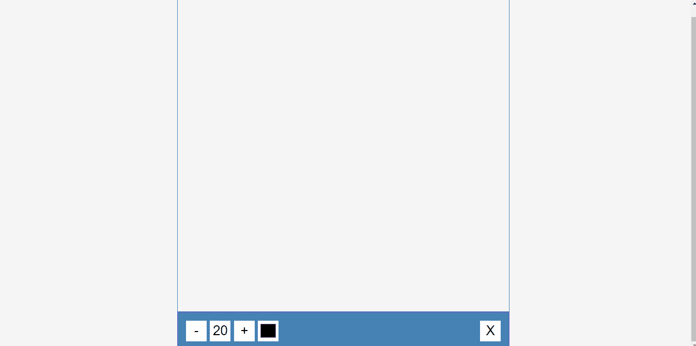
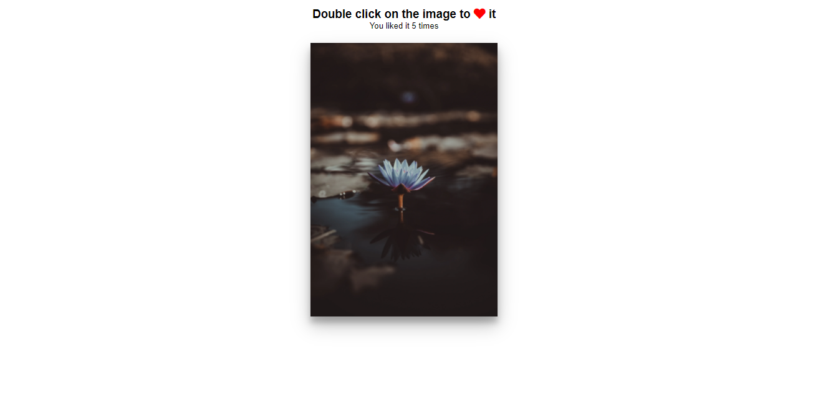
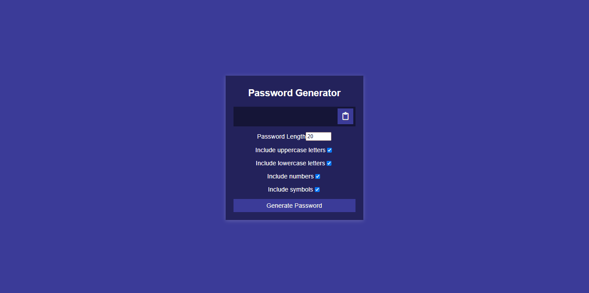

<h1 align="center">50 Projects In 50 Days</h1>

<h3 align="center">
    <a href="https://joaom00.github.io/50Projects50Days">Acesse o Site</a>
</h3>

  <table border="0" cellspacing="0" cellpadding="0">
    <thead>
      <tr>
        <th>
          <strong><a href="https://joaom00.github.io/50Projects50Days/day1-expanding-cards/index.html">Dia 01 - Expanding Cards</a></strong>
        </th>
        <th>
          <strong><a href="https://joaom00.github.io/50Projects50Days/day2-progress-steps/index.html">Dia 02 - Progress Steps</a></strong>
        </th>
      </tr>
    </thead>
    <tbody>
      <tr>
        <td>
          
        </td>
        <td>
          
        </td>
      </tr>
    </tbody>
  </table>

  <table border="0" cellspacing="0" cellpadding="0">
    <thead>
      <tr>
        <th>
          <strong><a href="https://joaom00.github.io/50Projects50Days/day3-rotating-navigation/index.html">Dia 03 - Rotating Navigation</a></strong>
        </th>
        <th>
          <strong><a href="https://joaom00.github.io/50Projects50Days/day4-hidden-search-widget/index.html">Dia 04 - Hidden Search Widget</a></strong>
        </th>
      </tr>
    </thead>
    <tbody>
      <tr>
        <td>
          
        </td>
        <td>
          
        </td>
      </tr>
    </tbody>
  </table>

  <table border="0" cellspacing="0" cellpadding="0">
    <thead>
      <tr>
        <th>
          <strong><a href="https://joaom00.github.io/50Projects50Days/day5-blurry-loading/index.html">Dia 05 - Blurry Loading</a></strong>
        </th>
        <th>
          <strong><a href="https://joaom00.github.io/50Projects50Days/day6-scroll-animation/index.html">Dia 06 - Scroll Animation</a></strong>
        </th>
      </tr>
    </thead>
    <tbody>
      <tr>
        <td>
          
        </td>
        <td>
          
        </td>
      </tr>
    </tbody>
  </table>

  <table border="0" cellspacing="0" cellpadding="0">
    <thead>
      <tr>
        <th>
          <strong><a href="https://joaom00.github.io/50Projects50Days/day7-split-landing-page/index.html">Dia 07 - Split Landing Page</a></strong>
        </th>
        <th>
          <strong><a href="https://joaom00.github.io/50Projects50Days/day8-form-wave-animation/index.html">Dia 08 - Form Wave Animation</a></strong>
        </th>
      </tr>
    </thead>
    <tbody>
      <tr>
        <td>
          
        </td>
        <td>
          
        </td>
      </tr>
    </tbody>
  </table>
  
  <table border="0" cellspacing="0" cellpadding="0">
    <thead>
      <tr>
        <th>
          <strong><a href="https://joaom00.github.io/50Projects50Days/day9-sound-board/index.html">Dia 09 - Sound Board</a></strong>
        </th>
        <th>
          <strong><a href="https://joaom00.github.io/50Projects50Days/day10-dad-jokes/index.html">Dia 10 - Dad Jokes</a></strong>
        </th>
      </tr>
    </thead>
    <tbody>
      <tr>
        <td>
          
        </td>
        <td>
          
        </td>
      </tr>
    </tbody>
  </table>

  <table border="0" cellspacing="0" cellpadding="0">
    <thead>
      <tr>
        <th>
          <strong><a href="https://joaom00.github.io/50Projects50Days/day11-event-keycodes/index.html">Dia 11 - Event KeyCodes</a></strong>
        </th>
        <th>
          <strong><a href="https://joaom00.github.io/50Projects50Days/day12-faq-collapse/index.html">Dia 12 - FAQ Collapse</a></strong>
        </th>
      </tr>
    </thead>
    <tbody>
      <tr>
        <td>
          
        </td>
        <td>
          
        </td>
      </tr>
    </tbody>
  </table>

  <table border="0" cellspacing="0" cellpadding="0">
    <thead>
      <tr>
        <th>
          <strong><a href="https://joaom00.github.io/50Projects50Days/day13-random-choice-picker/index.html">Dia 13 - Random Choice Picker</a></strong>
        </th>
        <th>
          <strong><a href="https://joaom00.github.io/50Projects50Days/day14-animated-navigation/index.html">Dia 14 - Animated Navigation</a></strong>
        </th>
      </tr>
    </thead>
    <tbody>
      <tr>
        <td>
          
        </td>
        <td>
          
        </td>
      </tr>
    </tbody>
  </table>

  <table border="0" cellspacing="0" cellpadding="0">
    <thead>
      <tr>
        <th>
          <strong><a href="https://joaom00.github.io/50Projects50Days/day15-incrementing-counter/index.html">Dia 15 - Incremeting Counter</a></strong>
        </th>
        <th>
          <strong><a href="https://joaom00.github.io/50Projects50Days/day16-drink-water/index.html">Dia 16 - Drink Water</a></strong>
        </th>
      </tr>
    </thead>
    <tbody>
      <tr>
        <td>
          
        </td>
        <td>
          
        </td>
      </tr>
    </tbody>
  </table>

  <table border="0" cellspacing="0" cellpadding="0">
    <thead>
      <tr>
        <th>
          <strong><a href="https://joaom00.github.io/50Projects50Days/day17-movie-app/index.html">Dia 17 - Movie App</a></strong>
        </th>
        <th>
          <strong><a href="https://joaom00.github.io/50Projects50Days/day18-background-slider/index.html">Dia 18 - Background Slider</a></strong>
        </th>
      </tr>
    </thead>
    <tbody>
      <tr>
        <td>
          
        </td>
        <td>
          
        </td>
      </tr>
    </tbody>
  </table>

  <table border="0" cellspacing="0" cellpadding="0">
    <thead>
      <tr>
        <th>
          <strong><a href="https://joaom00.github.io/50Projects50Days/day19-theme-clock/index.html">Dia 19 - Theme Clock</a></strong>
        </th>
        <th>
          <strong><a href="https://joaom00.github.io/50Projects50Days/day20-button-ripple-effect/index.html">Dia 20 - Button Ripple Effect</a></strong>
        </th>
      </tr>
    </thead>
    <tbody>
      <tr>
        <td>
          
        </td>
        <td>
          
        </td>
      </tr>
    </tbody>
  </table>

  <table border="0" cellspacing="0" cellpadding="0">
    <thead>
      <tr>
        <th>
          <strong><a href="https://joaom00.github.io/50Projects50Days/day21-drag-n-drop/index.html">Dia 21 - Drag N Drop</a></strong>
        </th>
        <th>
          <strong><a href="https://joaom00.github.io/50Projects50Days/day22-drawing-app/index.html">Dia 22 - Drawing App</a></strong>
        </th>
      </tr>
    </thead>
    <tbody>
      <tr>
        <td>
          
        </td>
        <td>
          
        </td>
      </tr>
    </tbody>
  </table>

  <table border="0" cellspacing="0" cellpadding="0">
    <thead>
      <tr>
        <th>
          <strong><a href="https://joaom00.github.io/50Projects50Days/day23-kinetic-css-loader/index.html">Dia 23 - Kinetic Css Loader</a></strong>
        </th>
        <th>
          <strong><a href="https://joaom00.github.io/50Projects50Days/day24-content-placeholder/index.html">Dia 24 - Content Placeholder</a></strong>
        </th>
      </tr>
    </thead>
    <tbody>
      <tr>
        <td>
          
        </td>
        <td>
          
        </td>
      </tr>
    </tbody>
  </table>

  <table border="0" cellspacing="0" cellpadding="0">
    <thead>
      <tr>
        <th>
          <strong><a href="https://joaom00.github.io/50Projects50Days/day25-sticky-navbar/index.html">Dia 25 - Sticky Navbar</a></strong>
        </th>
        <th>
          <strong><a href="https://joaom00.github.io/50Projects50Days/day26-double-vertical-slider/index.html">Dia 26 - Double Vertical Slider</a></strong>
        </th>
      </tr>
    </thead>
    <tbody>
      <tr>
        <td>
          
        </td>
        <td>
          
        </td>
      </tr>
    </tbody>
  </table>

  <table border="0" cellspacing="0" cellpadding="0">
    <thead>
      <tr>
        <th>
          <strong><a href="https://joaom00.github.io/50Projects50Days/day27-toast-notification/index.html">Dia 27 - Toast Notification</a></strong>
        </th>
        <th>
          <strong><a href="https://joaom00.github.io/50Projects50Days/day28-github-profiles/index.html">Dia 28 - Github Profiles</a></strong>
        </th>
      </tr>
    </thead>
    <tbody>
      <tr>
        <td>
          
        </td>
        <td>
          
        </td>
      </tr>
    </tbody>
  </table>

  <table border="0" cellspacing="0" cellpadding="0">
    <thead>
      <tr>
        <th>
          <strong><a href="https://joaom00.github.io/50Projects50Days/day29-double-heart-click/index.html">Dia 29 - Double Heart Click</a></strong>
        </th>
        <th>
          <strong><a href="https://joaom00.github.io/50Projects50Days/day30-auto-text-effect/index.html">Dia 30 - Auto Text Effect</a></strong>
        </th>
      </tr>
    </thead>
    <tbody>
      <tr>
        <td>
          
        </td>
        <td>
          
        </td>
      </tr>
    </tbody>
  </table>

  <table border="0" cellspacing="0" cellpadding="0">
    <thead>
      <tr>
        <th>
          <strong><a href="https://joaom00.github.io/50Projects50Days/day31-password-generator/index.html">Dia 31 - Password Generator</a></strong>
        </th>
        <th>
          <strong><a href="https://joaom00.github.io/50Projects50Days/day32-good-cheap-fast-checkboxes/index.html">Dia 32 - Good, Cheap, Fast</a></strong>
        </th>
      </tr>
    </thead>
    <tbody>
      <tr>
        <td>
          
        </td>
        <td>
          
        </td>
      </tr>
    </tbody>
  </table>

  <table border="0" cellspacing="0" cellpadding="0">
    <thead>
      <tr>
        <th>
          <strong><a href="https://joaom00.github.io/50Projects50Days/day33-notes-app/index.html">Dia 33 - Notes App</a></strong>
        </th>
        <th>
          <strong><a href="https://joaom00.github.io/50Projects50Days/day34-animated-countdown/index.html">Dia 34 - Animated Countdown</a></strong>
        </th>
      </tr>
    </thead>
    <tbody>
      <tr>
        <td>
          
        </td>
        <td>
          
        </td>
      </tr>
    </tbody>
  </table>

  <table border="0" cellspacing="0" cellpadding="0">
    <thead>
      <tr>
        <th>
          <strong><a href="https://joaom00.github.io/50Projects50Days/day35-image-carousel/index.html">Dia 35 - Image Carousel</a></strong>
        </th>
        <th>
          <strong><a href="https://joaom00.github.io/50Projects50Days/day36-hoverboard/index.html">Dia 36 - Hoverboard</a></strong>
        </th>
      </tr>
    </thead>
    <tbody>
      <tr>
        <td>
          
        </td>
        <td>
          
        </td>
      </tr>
    </tbody>
  </table>

  <table border="0" cellspacing="0" cellpadding="0">
    <thead>
      <tr>
        <th>
          <strong><a href="https://joaom00.github.io/50Projects50Days/day37-pokedex/index.html">Dia 37 - Pokedex</a></strong>
        </th>
        <th>
          <strong><a href="https://joaom00.github.io/50Projects50Days/day38-mobile-tag-navigation/index.html">Dia 38 - Mobile Tag Navigation</a></strong>
        </th>
      </tr>
    </thead>
    <tbody>
      <tr>
        <td>
          
        </td>
        <td>
          
        </td>
      </tr>
    </tbody>
  </table>

  <table border="0" cellspacing="0" cellpadding="0">
    <thead>
      <tr>
        <th>
          <strong><a href="https://joaom00.github.io/50Projects50Days/day39-password-strength-background/index.html">Dia 39 - Password Strength Background</a></strong>
        </th>
        <th>
          <strong><a href="https://joaom00.github.io/50Projects50Days/day40-background-boxes/index.html">Dia 40 - 3D Background Box</a></strong>
        </th>
      </tr>
    </thead>
    <tbody>
      <tr>
        <td>
          
        </td>
        <td>
          
        </td>
      </tr>
    </tbody>
  </table>

  <table border="0" cellspacing="0" cellpadding="0">
    <thead>
      <tr>
        <th>
          <strong><a href="https://joaom00.github.io/50Projects50Days/day41-verify-account-ui/index.html">Dia 41 - Verify Account UI</a></strong>
        </th>
        <th>
          <strong><a href="https://joaom00.github.io/50Projects50Days/day42-live-user-filter/index.html">Dia 42 - Live User Filter</a></strong>
        </th>
      </tr>
    </thead>
    <tbody>
      <tr>
        <td>
          
        </td>
        <td>
          
        </td>
      </tr>
    </tbody>
  </table>

  <table border="0" cellspacing="0" cellpadding="0">
    <thead>
      <tr>
        <th>
          <strong><a href="https://joaom00.github.io/50Projects50Days/day43-feedback-ui-design/index.html">Dia 43 - Feedback UI Design</a></strong>
        </th>
        <th>
          <strong><a href="https://joaom00.github.io/50Projects50Days/day44-custom-range-slider/index.html">Dia 44 - Custom Range Slider</a></strong>
        </th>
      </tr>
    </thead>
    <tbody>
      <tr>
        <td>
          
        </td>
        <td>
          
        </td>
      </tr>
    </tbody>
  </table>

  <table border="0" cellspacing="0" cellpadding="0">
    <thead>
      <tr>
        <th>
          <strong><a href="https://joaom00.github.io/50Projects50Days/day45-netflix-navigation/index.html">Dia 45 - Netflix Navigation</a></strong>
        </th>
        <th>
          <strong><a href="https://joaom00.github.io/50Projects50Days/day46-quiz-app/index.html">Dia 46 - Quiz App</a></strong>
        </th>
      </tr>
    </thead>
    <tbody>
      <tr>
        <td>
          
        </td>
        <td>
          
        </td>
      </tr>
    </tbody>
  </table>

  <table border="0" cellspacing="0" cellpadding="0">
    <thead>
      <tr>
        <th>
          <strong><a href="https://joaom00.github.io/50Projects50Days/day47-testimonial-box-switcher/index.html">Dia 47 - Testimonial Box Switcher</a></strong>
        </th>
        <th>
          <strong><a href="https://joaom00.github.io/50Projects50Days/day48-random-image-feed/index.html">Dia 48 - Random Image Feed</a></strong>
        </th>
      </tr>
    </thead>
    <tbody>
      <tr>
        <td>
          
        </td>
        <td>
          
        </td>
      </tr>
    </tbody>
  </table>

  <table border="0" cellspacing="0" cellpadding="0">
    <thead>
      <tr>
        <th>
          <strong><a href="https://joaom00.github.io/50Projects50Days/day49-todo-list/index.html">Dia 49 - Todo List</a></strong>
        </th>
        <th>
          <strong><a href="https://joaom00.github.io/50Projects50Days/day50-insect-catch-game/index.html">Dia 50 - Insect Catch Game</a></strong>
        </th>
      </tr>
    </thead>
    <tbody>
      <tr>
        <td>
          
        </td>
        <td>
          
        </td>
      </tr>
    </tbody>
  </table>

