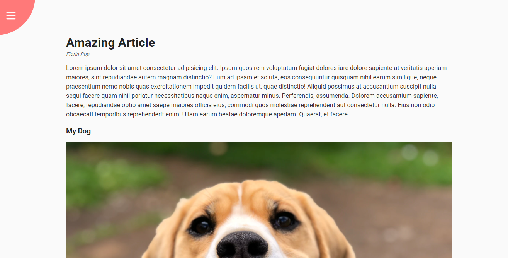

<h1 align="center">50 Projects In 50 Days</h1>

[Veja todos os projetos](https://joaom00.github.io/50Projects50Days/)

  <table border="0" cellspacing="0" cellpadding="0">
    <thead>
      <tr>
        <th>
          <strong><a href="https://joaom00.github.io/50Projects50Days/day1-expanding-cards/index.html">Dia 01 - Expanding Cards</a></strong>
        </th>
        <th>
          <strong><a href="https://joaom00.github.io/50Projects50Days/day2-progress-steps/index.html">Dia 02 - Progress Steps</a></strong>
        </th>
      </tr>
    </thead>
    <tbody>
      <tr>
        <td>
          
        </td>
        <td>
          
        </td>
      </tr>
    </tbody>
  </table>

  <table border="0" cellspacing="0" cellpadding="0">
    <thead>
      <tr>
        <th>
          <strong><a href="https://joaom00.github.io/50Projects50Days/day3-rotating-navigation/index.html">Dia 03 - Rotating Navigation</a></strong>
        </th>
        <th>
          <strong><a href="https://joaom00.github.io/50Projects50Days/day4-hidden-search-widget/index.html">Dia 04 - Hidden Search Widget</a></strong>
        </th>
      </tr>
    </thead>
    <tbody>
      <tr>
        <td>
          
        </td>
        <td>
          
        </td>
      </tr>
    </tbody>
  </table>

